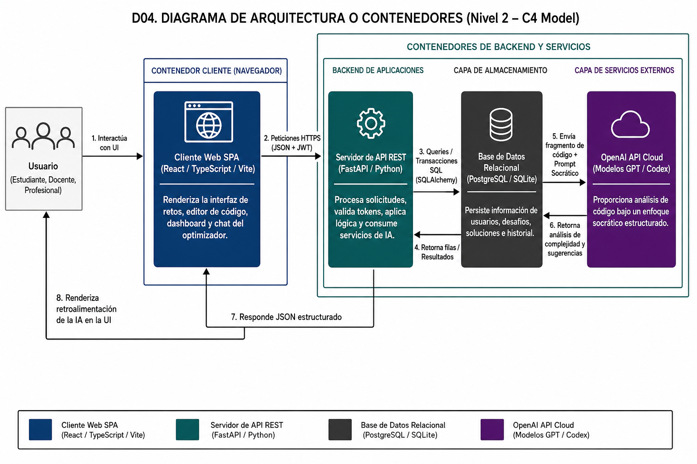
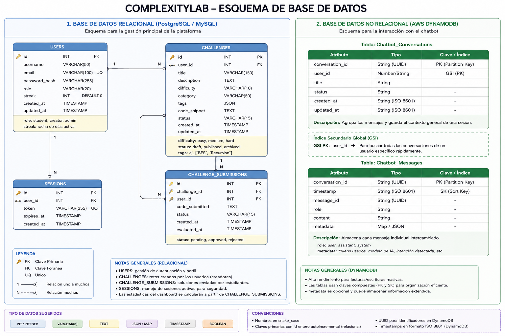
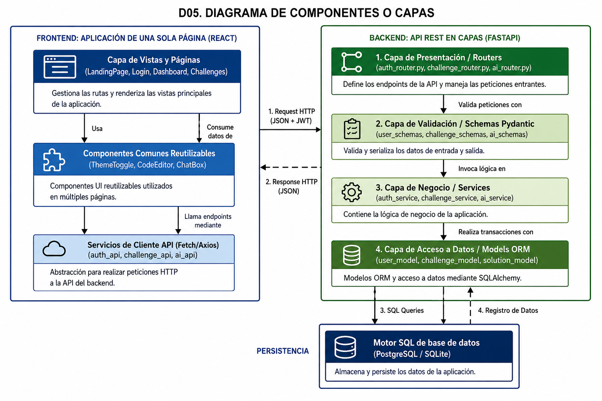
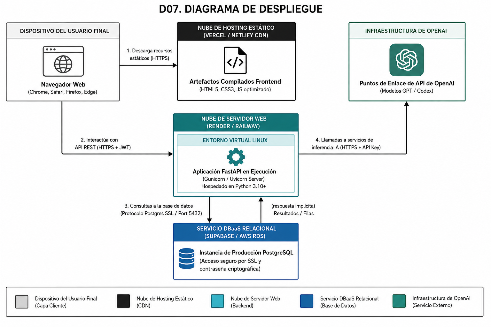
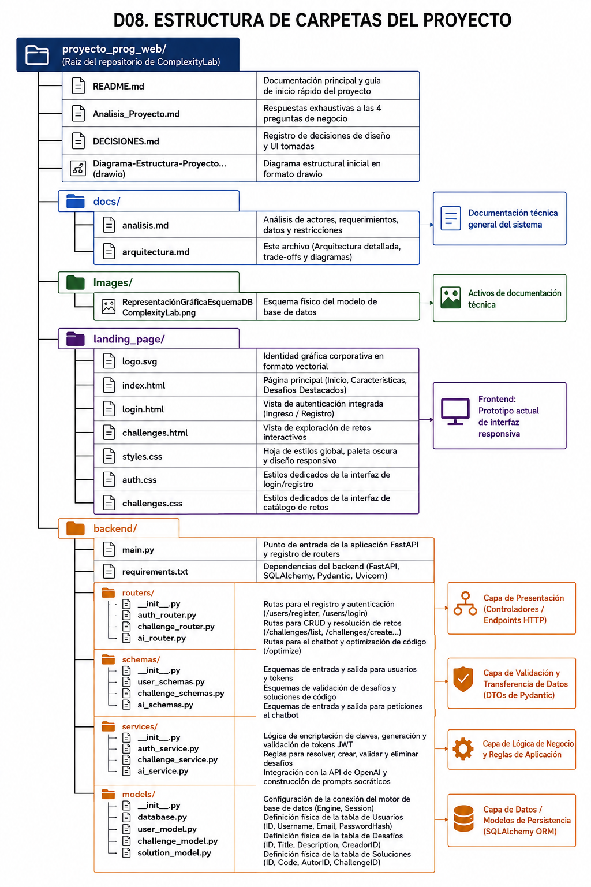

<div align="center">

# ⚙️ ComplexityLab

**Plataforma educativa impulsada por IA para explorar, resolver y analizar la complejidad algorítmica.**

[](https://developer.mozilla.org/es/docs/Web/HTML)
[](https://developer.mozilla.org/es/docs/Web/CSS)
[](https://developer.mozilla.org/es/docs/Web/JavaScript)
[](https://react.dev/)
[](https://www.typescriptlang.org/)
[](https://vite.dev/)
[](https://fastapi.tiangolo.com/)
[](https://www.python.org/)
[](https://www.postgresql.org/)
[](https://www.sqlite.org/)

---

</div>

<br/>

## 📋 TABLA DE CONTENIDO

- [Descripción](#-descripción)
- [Stack Tecnológico](#-stack-tecnológico)
- [Arquitectura del Sistema](#-arquitectura-del-sistema)
- [Instalación y Configuración](#-instalación-y-configuración)
  - [Frontend (Prototipo Actual)](#1-frontend-prototipo-landing-page)
  - [Backend (Servidor FastAPI)](#2-backend-servidor-fastapi-planificado)
- [Endpoints de la API](#-endpoints-de-la-api)
- [Capturas y Diagramas](#-capturas-y-diagramas)
- [Documentación Adicional](#-documentación-adicional)
- [Desarrolladores](#-desarrolladores)

---

## 📝 DESCRIPCIÓN

La premisa principal de **ComplexityLab** es ofrecer una plataforma educativa que permita a los usuarios explorar y comprender de manera práctica la **complejidad algorítmica (Notación Big O)**. Creemos que la mejor forma de aprender es mediante la experimentación y el descubrimiento guiado. 

Por esta razón, la plataforma implementa un **enfoque socrático** a través de Inteligencia Artificial para guiar a los estudiantes en el proceso de optimización, dándoles pistas e ideas para reducir la complejidad temporal $O(n)$ o espacial de su código, en lugar de entregarles la solución terminada directamente.

### Público Objetivo:
* **Estudiantes de informática:** Para aprender los conceptos básicos y avanzados de estructuras de datos y algoritmia de manera guiada.
* **Profesionales de informática:** Para practicar y optimizar soluciones de código complejas bajo estándares óptimos de rendimiento.
* **Docentes de informática:** Para crear desafíos interactivos, realizar un seguimiento socrático y evaluar el progreso de sus alumnos.

---

## 🧠 STACK TECNOLÓGICO

El ecosistema tecnológico elegido para la plataforma asegura el desacoplamiento de capas y la escalabilidad del sistema:

### Cliente (Frontend SPA)
* **Estructura y Estilos:** HTML5, CSS3 nativo (diseño responsive, paleta oscura moderna y animaciones sutiles).
* **Framework:** React + TypeScript para modularización y desarrollo seguro basado en componentes.
* **Build Tool:** Vite para compilación ultrarrápida en tiempo de desarrollo.

### Servidor (Backend API)
* **Framework:** FastAPI (Python) para servicios API REST asíncronos y auto-documentados.
* **Manejador de Datos (ORM):** SQLAlchemy para la abstracción de consultas y transacciones orientadas a objetos.
* **Validación:** Pydantic para tipado estático y estructurado de datos de entrada/salida.

### Motores de Persistencia (Base de Datos)
* **Desarrollo:** SQLite para arranques rápidos sin configuración local compleja.
* **Producción:** PostgreSQL para bases de datos relacionales estables con soporte ACID total.

---

## 🏛️ ARQUITECTURA DEL SISTEMA

ComplexityLab está diseñado bajo un modelo **Cliente-Servidor (Client-Server)** desacoplado, comunicándose a través de peticiones HTTP RESTful asíncronas con payloads JSON y seguridad mediante tokens JWT. 

El Backend implementa un patrón de **Arquitectura en Capas (N-Layer)**:
`Routers (Presentación) -> Schemas (Validación) -> Services (Lógica e Integración LLM) -> Models (Persistencia ORM)`.



```mermaid
graph TB
    User["Usuario<br/>(Estudiante / Docente)"] -->|Usa UI| Browser["Navegador Web<br/>(React SPA)"]
    
    subgraph ServidorBackend["Backend de ComplexityLab"]
        API["REST API Server<br/>(FastAPI / Python)"]
        DB[("Base de Datos<br/>(PostgreSQL / SQLite)")]
    end
    
    subgraph ServicioExterno["IA Cloud"]
        OpenAI["OpenAI API<br/>(Codex / GPT)"]
    end
    
    Browser -->|HTTP Requests (JSON + JWT)| API
    API -->|ORM queries (SQLAlchemy)| DB
    API -->|Consulta socrática (Prompt)| OpenAI
    OpenAI -->|Sugerencias de optimización| API
    DB -->|Retorno de filas / Entidades| API
    API -->|Respuestas HTTP (JSON)| Browser
```

> 📖 Para una descripción completa de la arquitectura, decisiones de diseño, compromisos técnicos (trade-offs) y diagramas detallados (Capas, Despliegue, Carpetas), consulte el documento de arquitectura en [docs/arquitectura.md](./docs/arquitectura.md).

---

## ⚙️ INSTALACIÓN Y CONFIGURACIÓN

Siga los siguientes pasos para ejecutar y probar las dos partes que integran la plataforma localmente:

### 1. Frontend (Prototipo Landing Page)
Actualmente, el repositorio cuenta con un prototipo visual responsivo en la carpeta `landing_page/`.

* **Ejecución Directa:**
  No requiere compilación preliminar. Simplemente abra el archivo [index.html](./landing_page/index.html) en cualquier navegador web moderno, o inícielo a través de una extensión de servidor local como *Live Server* en VSCode o usando su instalación local de *WampServer*.

* **Estructura del Prototipo:**
  * [Página de Inicio (Landing Page)](./landing_page/index.html)
  * [Autenticación (Login / Registro)](./landing_page/login.html)
  * [Catálogo de Desafíos](./landing_page/challenges.html)

---

### 2. Backend (Servidor FastAPI — planificado)
> Nota: actualmente este repositorio no incluye la carpeta `backend/`. Los siguientes pasos aplican cuando se agregue la implementación del servidor.
La estructura del backend se sitúa en la carpeta `backend/`. Siga estos pasos para configurar el entorno:

1. **Navegar al directorio del backend:**
   ```bash
   cd backend
   ```

2. **Crear y activar un entorno virtual de Python:**
   * En Windows:
     ```bash
     python -m venv venv
     .\venv\Scripts\activate
     ```
   * En macOS/Linux:
     ```bash
     python3 -m venv venv
     source venv/bin/activate
     ```

3. **Instalar las dependencias requeridas:**
   ```bash
   pip install -r requirements.txt
   ```

4. **Configurar las variables de entorno:**
   Cree un archivo `.env` en la raíz de la carpeta `backend/` y agregue las credenciales correspondientes:
   ```env
   DATABASE_URL=sqlite:///./complexitylab.db
   SECRET_KEY=clave_secreta_para_firmar_jwt_de_desarrollo
   OPENAI_API_KEY=tu_api_key_de_openai_para_chatbot_socratico
   ```

5. **Iniciar el servidor de desarrollo:**
   ```bash
   uvicorn main:app --reload
   ```
   El servidor estará disponible en [http://localhost:8000](http://localhost:8000) y la documentación OpenAPI auto-generada se podrá explorar en [http://localhost:8000/docs](http://localhost:8000/docs).

---

## 🔌 ENDPOINTS DE LA API

A continuación se detalla la matriz de endpoints de la API REST que gestiona el servidor:

| Módulo | Método | Endpoint | Descripción | Requiere Auth (JWT) |
| :--- | :--- | :--- | :--- | :---: |
| **Autenticación** | `POST` | `/users/register` | Registra una nueva cuenta de usuario en la plataforma. | No |
| **Autenticación** | `POST` | `/users/login` | Autentica un usuario y le proporciona un token JWT. | No |
| **Desafíos** | `GET` | `/challenges/list` | Recupera todos los desafíos algorítmicos publicados. | No |
| **Desafíos** | `POST` | `/challenges/create` | Crea un nuevo desafío (asociándolo al autor). | **Sí** |
| **Desafíos** | `PUT` | `/challenges/edit/{id}` | Edita el título o descripción de un desafío (solo propietario). | **Sí** |
| **Desafíos** | `DELETE` | `/challenges/delete/{id}` | Elimina físicamente un desafío de la base de datos (solo propietario). | **Sí** |
| **Desafíos** | `POST` | `/challenges/solve/{id}` | Registra la solución enviada por un usuario para un desafío. | **Sí** |
| **Optimizador** | `POST` | `/optimize` | Envía código al chatbot para recibir sugerencias de optimización. | **Sí** |
| **Dashboard** | `GET` | `/dashboard` | Retorna estadísticas personales del usuario (desafíos creados/resueltos). | **Sí** |

---

## 🖼️ CAPTURAS Y DIAGRAMAS

A continuación se muestran los diagramas que ilustran la estructura física y lógica del proyecto:

### 1. Diagrama de Estructura de Proyecto
Mapeo inicial de los componentes del sistema:


### 2. Esquema Relacional de Base de Datos
Representación gráfica de las tablas, atributos y llaves foráneas definidas para persistencia:


### 3. Diagrama de Arquitectura y Contenedores (D04)


### 4. Diagrama de Capas y Componentes (D05)


### 5. Diagrama de Despliegue de Infraestructura (D07)


### 6. Diagrama de la Estructura de Carpetas (D08)


---

## 📂 DOCUMENTACIÓN ADICIONAL

Para profundizar en el análisis funcional e informático de ComplexityLab, explore la carpeta [docs/](./docs/):
* **Análisis del Negocio y Sistema:** [`docs/analisis.md`](./docs/analisis.md) — Describe quién usa el sistema, qué necesita hacer, qué datos maneja y qué restricciones existen (Las 4 preguntas de diseño).
* **Arquitectura de Software y Sistemas:** [`docs/arquitectura.md`](./docs/arquitectura.md) — Describe el estilo, capas, flujo de datos detallado, justificación del stack, trade-offs y los diagramas C4 de contenedores, componentes y despliegue del sistema.

---

## 🧑‍💻 DESARROLLADORES

* [Juan David Berrio Rivera](https://github.com/DeviDO527)
* [Sebastian Betancourt Gonzalez](https://github.com/SebastianBetancourt777)
* [Juan José Lopera Londoño](https://github.com/Loperaa-Juan)
* [Juan José Zabala Preciado](https://github.com/zabalapreciado-alt)
