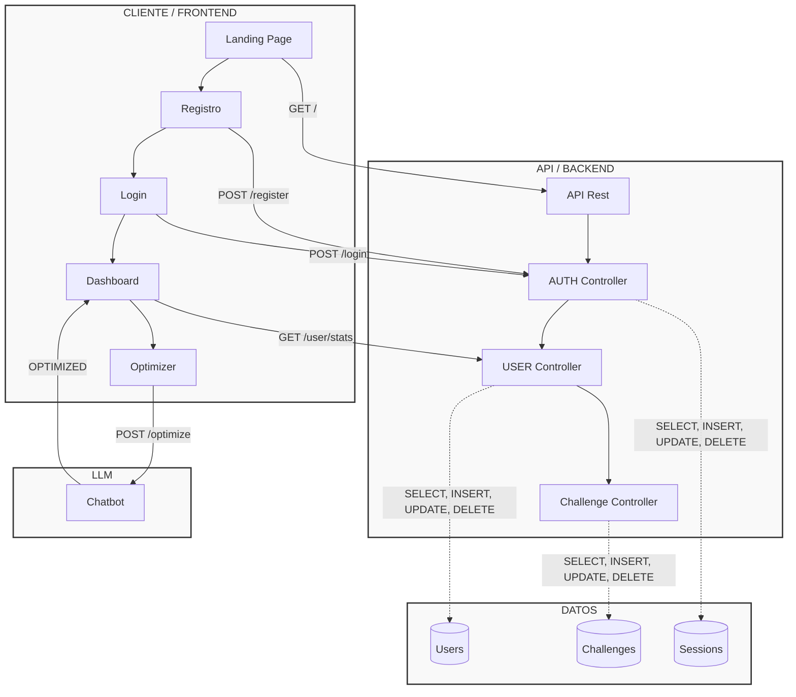

<div align="center">

# ⚙️ ComplexityLab

**Plataforma educativa impulsada por IA para explorar y analizar la complejidad algorítmica.**

[](https://reactjs.org/)
[](https://www.typescriptlang.org/)
[](https://vitejs.dev/)
[](https://fastapi.tiangolo.com/)
[](https://www.python.org/)

---


</div>

<br/>


## 📋 TABLA DE CONTENIDO

- [Descripción](#descripción)
- [Stack Tecnológico](#stack-tecnológico)
- [Diagramas del cliente](#diagramas-del-cliente)
- [Flujos HTTP](#flujos-http)
  - [Flujo de registro](#1-flujo-de-registro)
  - [Flujo de inicio de sesión (Authentication)](#2-flujo-de-inicio-de-sesión-authentication)
  - [Flujo de creación de un challenge](#3-flujo-de-creación-de-un-challenge)
    - [Flujo de edición de un challenge](#31-flujo-de-edición-de-un-challenge)
    - [Flujo de eliminación de un challenge](#32-flujo-de-eliminación-de-un-challenge)
    - [Flujo de listado de challenges](#33-flujo-de-listado-de-challenges)
    - [Flujo de solución de solución de un challenge](#34-flujo-de-solución-de-un-challenge)
  - [Flujo del optimizador (chatbot)](#4-flujo-del-optimizador-de-código-chatbot)
  - [Flujo del dashboard](#5-flujo-del-dashboard)
- [Capa del servidor](#capa-del-servidor)
- [Capa de persistencia (Base de Datos)](#capa-de-persistencia)
- [Desarrolladores](#desarrolladores)

---

## 📝 **DESCRIPCIÓN**

La idea principal de ComplexityLab es ofrecer una plataforma que permita a los usuarios explorar y analizar la complejidad de diferentes algoritmos. Partimos de la base de que la mejor forma de aprender es mediante la experimentación y el descubrimiento guiado, por lo que nuestra plataforma se basa en el pensamiento socrático para guiar a los usuarios en el proceso de aprendizaje, sin caer en la trampa de dar la solución directamente.

Buscamos que sea una herramienta universal usada tanto por estudiantes (tanto principiantes como avanzados en el area de la informatica) como por profesionales que buscan optimizar la forma en la que programan. El core de la plataforma se centra en un nucleo educacional donde el usuario soluciona problemas de programacion, y la IA analiza la complejidad de la solucion y le da retroalimentacion para mejorarla.

El objetivo principal de nuestra aplicación es sembrar en el usuario un pensamiento algoritmico y analitico, que le permita resolver problemas de programacion de manera eficiente y optimizada. 

---

## 🧠 **STACK TECNOLÓGICO**

### 🎨 **CLIENTE**

- **Framework:** React
- **Lenguaje:** TypeScript
- **Build tool:** Vite

### 🖥️ **BACKEND**

- **Framework:** FastAPI
- **Lenguaje:** Python

---

## **DIAGRAMAS DEL CLIENTE**

---

## **FLUJOS HTTP**

En este caso, los flujos HTTP se refieren a las peticiones que se hacen desde el cliente al servidor, y las respuestas que se reciben. Para nuestro caso especifico, debemos tomar los diferentes casos de uso que se presentan en nuestra aplicacion y documentarlos.

### **1. Flujo de registro**

1. El usuario se registra en la plataforma.
2. El servidor recibe la petición y crea una cuenta.
3. El servidor envía una respuesta al cliente.

Esto en lógica se ve reflejado en una petición POST a la ruta /users/register. El servidor debe validar que el usuario no exista, y si no existe, crear una cuenta. Acto seguido debemos enviar una respuesta al cliente indicando que el usuario se ha creado correctamente. En un caso contrario, si el usuario ya existe, debemos enviar una respuesta al cliente indicando que el usuario ya existe. El formato de respuesta debe ser el siguiente:

```json
{
    "message": "Usuario creado correctamente",
    "data": {
        "id": 1,
        "username": "usuario",
        "email": "[EMAIL_ADDRESS]"
    }
}
```

Una vez completado el flujo de registro, el usuario debe iniciar sesión para poder acceder a la plataforma. 

### **2. Flujo de inicio de sesión (Authentication)**

1. El usuario ingresa sus credenciales (correo y contraseña).
2. El servidor recibe la petición y valida que el usuario exista.
3. El servidor envía una respuesta al cliente.

Esto en lógica se ve reflejado en una petición POST a la ruta /users/login. El servidor debe validar que el usuario exista, y si no existe, lanzar un error `404 Not Found` y sugiriendo que se registre. Acto seguido debemos enviar una respuesta al cliente indicando que el usuario se ha autenticado correctamente, para este caso retornamos un token JWT (JSON Web Token) que será usado para autenticar las peticiones al servidor, de esta manera tenemos control de saber quien es el usuario que esta haciendo la petición. El formato de respuesta debe ser el siguiente:

```json
{
    "access_token": "<token>",
    "token_type": "bearer"
}
```

Una vez finalizado el flujo de inicio de sesión, el usuario podrá acceder a la plataforma. Dentro de esta hay diferentes rutas, cada una con su respectivo flujo. A continuación se muestra un ejemplo de flujo de uso de la plataforma:

### **3. Flujo de creación de un challenge**

1. El usuario crea un `challenge` de programación con su nombre y descripción.
2. El servidor recibe la petición y crea un challenge, asociandolo al usuario que lo creó.
3. El servidor envía una respuesta al cliente.

Esto en lógica se ve reflejado en una petición POST a la ruta /challenges/create. Lo primordial es que el servidor debe validar que quién tramite esta petición sea un usuario autenticado dentro de la plataforma, de lo contrario debemos retornar un código de error `401 Unauthorized`. En el caso ideal de que el usuario exista, debemos crear el challenge y retornarlo al cliente. El formato de respuesta debe ser el siguiente:

```json
{
    "message": "Challenge creado correctamente",
    "data": {
        "id": 1,
        "title": "Challenge",
        "description": "Descripción del challenge"
    }
}
```

Dentro de este flujo, debemos tener en cuenta que, así como crea, el usuario también puede editar, eliminar y listar sus challenges. Sin olvidar que cuenta con la opción de solucionar los challenges propuestos por otros usuarios de la plataforma, teniendo esto en cuenta, estos son los sub flujos que se desprenden de este: 

#### **3.1. Flujo de edición de un challenge**

1. El usuario selecciona un `challenge` propio que desee editar. 
2. El servidor recibe la petición y la procesa para generar una respuesta. 
3. El servidor envía la respuesta al cliente. 

Para esta implementación, se hace uso de una petición PUT a la ruta /challenges/edit/{id}. A la hora de crear el challenge, este se asocia con el id del usuario que lo creó, por lo que a la hora de editarlo, debemos validar que el usuario que lo creó sea el mismo que lo desea editando, de lo contrario debemos responder con un código de `Unauthorized`. El formato de respuesta debe ser el siguiente: 

```json 
{
    "message": "Challenge editado correctamente",
    "data": {
        "id": 1,
        "title": "Challenge",
        "description": "Descripción del challenge"
    }
}
``` 

#### **3.2. Flujo de eliminación de un challenge**

1. El usuario selecciona un `challenge` de programación en base a su id. 
2. El servidor recibe la petición y la procesa aplicando la lógica bajo la eliminación. 
3. El servidor envía una respuesta al cliente. 

Esto en lógica se ve reflejado en una petición DELETE a la ruta /challenges/delete/{id} siendo `id` el identificador único del challenge en la base de datos. Como en el endpoint anterior, no basta con verificar que el usuario que esté tramitando la petición esté autenticado, también debe ser el usuario propietario del challenge, de lo contrario debemos rechazar la petición. El formato de respuesta debe ser el siguiente: 

```json 
{
    "message": "Challenge eliminado correctamente",
    "data": {
        "id": 1,
        "title": "Challenge",
        "description": "Descripción del challenge"
    }
}
``` 

#### **3.3. Flujo de listado de challenges**

1. El usuario solicita el listado de `challenges` disponibles en la plataforma.
2. El servidor recibe la petición y la procesa para generar una respuesta.
3. El servidor envía la respuesta al cliente.

Para llevar a cabo este flujo, se hace uso de una petición GET a la ruta /challenges/list. En este caso, no es necesario validar que el usuario esté autenticado, ya que el listado de challenges es público, sin embargo, si el usuario está autenticado, podemos personalizar la respuesta para mostrarle los challenges que ha creado y los que ha solucionado. El formato de respuesta debe ser el siguiente: 

```json 
{
    "message": "Listado de challenges",
    "data": [
        {
            "id": 1,
            "title": "Challenge 1",
            "description": "Descripción del challenge 1"
        },
        {
            "id": 2,
            "title": "Challenge 2",
            "description": "Descripción del challenge 2"
        }
    ]
}
```

Con este flujo, el usuario puede explorar los diferentes challenges disponibles en la plataforma, y seleccionar el que desee para solucionarlo.

#### **3.4. Flujo de solución de un challenge**

1. El usuario mira la lista de `challenges` disponibles en la plataforma y selecciona uno para solucionarlo.
2. El usuario envía su solución al servidor.
3. Solo el creador del challenge puede ver la solución enviada por el usuario, y el servidor envía una respuesta al cliente indicando que la solución ha sido enviada correctamente.

La lógica de este flujo se ve reflejada en una petición POST a la ruta /challenges/solve/{id} siendo `id` el identificador único del challenge en la base de datos. Para este flujo, es necesario validar que el usuario esté autenticado, de lo contrario debemos rechazar la petición. El formato de respuesta debe ser el siguiente: 

```json 
{
    "message": "Solución enviada correctamente",
    "data": {
        "challenge_id": 1,
        "solution": "Código de la solución"
    }
}
```

Además, el challenge en la base de datos debe tener un campo que indique si el challenge ha sido solucionado o no, y otro campo que indique el usuario que lo solucionó, de esta manera, el creador del challenge puede ver la solución enviada por el usuario, y decidir si la aprueba o no.

Una vez la solución haya sido revisada y aprobada por el creador del challenge, hacemos una actualización del estado del challenge para indicar que ha sido solucionado, y el usuario que lo solucionó recibe una notificación indicando que su solución ha sido aprobada.

### **4. Flujo del Optimizador de código (Chatbot)**

1. El usuario envía una consulta al chatbot para optimizar su código. (Ejemplo: "¿Cómo puedo optimizar este código?")
2. El servidor recibe la petición y procesa la consulta utilizando un modelo de lenguaje natural (LLM como GPT, Claude, etc. via API) para generar una respuesta.
3. El servidor envía la respuesta al cliente.

Para hacer realidad este flujo, hacemos una petición POST a la ruta /optimize. En esta petición, el usuario debe enviar su código y una descripción del problema que desea resolver, de esta manera, el modelo de lenguaje natural puede entender mejor el contexto y generar una respuesta más precisa. El formato de la petición debe ser el siguiente: 

```json 
{
    "code": "Código que desea optimizar",
    "description": "Descripción del problema que desea resolver"
}
```

Una vez el servidor recibe la petición, debe procesarla utilizando un modelo de lenguaje natural para generar una respuesta que contenga sugerencias de optimización para el código enviado por el usuario. El formato de la respuesta debe ser el siguiente: 

```json 
{
    "message": "Sugerencias de optimización",
    "data": {
        "optimized_code": "Código optimizado",
        "suggestions": [
            "Sugerencia 1",
            "Sugerencia 2"
        ]
    }
}
```

NOTA: Para este flujo debemos tener en cuenta dos aspectos bastante importantes:

* El gran modelo de lenguaje a utilizar debe haber sido sometido a un post-training en el area de la generación de código, para este caso el modelo más recomendado es Codex de OpenAI, sin embargo, también se pueden usar otros modelos como GPT-3 o Claude, siempre y cuando hayan sido sometidos a un post-training en el area de la generación de código. Además, nos comunicaremos con el modelo a través de su API, debido a las limitaciones de hardware que tenemos para entrenar un modelo de lenguaje natural desde cero.

* El modelo debe tener un system prompt bien definido, que le indique al modelo que su función principal es optimizar código, y que debe generar sugerencias de optimización para el código enviado por el usuario, pero nunca debe generar la solución completa, ya que el objetivo es que el usuario aprenda a optimizar su código, y no que el modelo le entregue la solución lista para usar.

### **5. Flujo del dashboard**

1. El usuario accede a su dashboard para ver sus estadísticas y progreso.
2. El servidor recibe la petición y procesa la información para generar una respuesta.
3. El servidor envía la respuesta al cliente.

El dashboard es una sección de la plataforma donde el usuario puede ver sus estadísticas y progreso en la plataforma, como por ejemplo, el número de challenges que ha creado, el número de challenges que ha solucionado, entre otros. Para hacer realidad este flujo, hacemos una petición GET a la ruta /dashboard. En esta petición, el servidor debe validar que el usuario esté autenticado y que tenga permisos para acceder al dashboard, de lo contrario debemos rechazar la petición. El formato de la respuesta debe ser el siguiente: 

```json 
{
    "message": "Dashboard",
    "data": {
        "created_challenges": 5,
        "solved_challenges": 10,
    }
}
```
---

## **CAPA DEL SERVIDOR**


---

## 🧑‍💻 **DESARROLLADORES**

- [Juan David Berrio Rivera](https://github.com/DeviDO527)
- [Sebastian Betancourt Gonzalez](https://github.com/SebastianBetancourt777)
- [Juan José Lopera Londoño](https://github.com/Loperaa-Juan)
- [Juan José Zabala Preciado](https://github.com/zabalapreciado-alt)