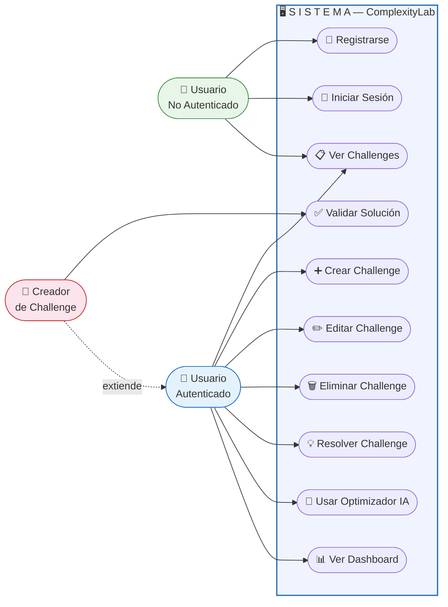

# D01 — Diagrama de Casos de Uso
## ComplexityLab

> **¿Qué es un diagrama de casos de uso?**
> Muestra **quiénes** usan el sistema (actores) y **qué pueden hacer** dentro de él (casos de uso). Es la vista del sistema desde los ojos del usuario, no del programador.

## Descripción de actores

| Actor | Descripción |
|-------|------------|
| **Usuario No Autenticado** | Visitante que aún no ha iniciado sesión. Solo puede ver la landing page, registrarse y ver el listado público de challenges. |
| **Usuario Autenticado** | Usuario con sesión activa (token JWT válido). Tiene acceso a todas las funciones principales de la plataforma. |
| **Creador de Challenge** | Es un Usuario Autenticado que además creó al menos un challenge. Tiene el permiso adicional de revisar y validar las soluciones que otros usuarios envían a sus challenges. |

## Descripción de casos de uso

| ID | Caso de uso | Actor | Descripción |
|----|------------|-------|-------------|
| UC1 | Registrarse | Usuario No Autenticado | Crear una cuenta nueva con username, email y contraseña |
| UC2 | Iniciar Sesión | Usuario No Autenticado | Autenticarse con email y contraseña para recibir un JWT |
| UC3 | Ver Challenges | Todos | Consultar el listado público de challenges disponibles |
| UC4 | Crear Challenge | Usuario Autenticado | Publicar un nuevo challenge con título y descripción |
| UC5 | Editar Challenge | Usuario Autenticado | Modificar el título o descripción de un challenge propio |
| UC6 | Eliminar Challenge | Usuario Autenticado | Borrar un challenge propio del sistema |
| UC7 | Resolver Challenge | Usuario Autenticado | Enviar código como solución a un challenge de otro usuario |
| UC8 | Validar Solución | Creador de Challenge | Revisar y aprobar o rechazar una solución recibida |
| UC9 | Usar Optimizador IA | Usuario Autenticado | Enviar código al chatbot y recibir pistas de optimización |
| UC10 | Ver Dashboard | Usuario Autenticado | Consultar estadísticas personales y posición en el ranking |
