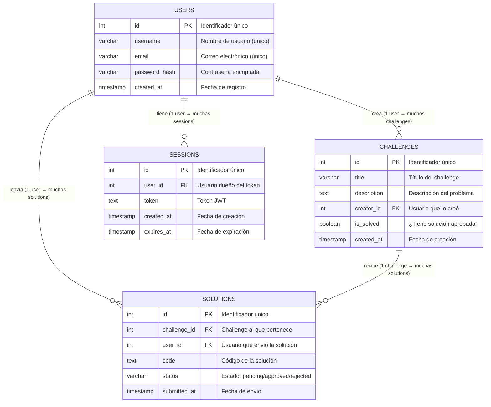

# D03 — Diagrama Entidad-Relación
## ComplexityLab

> **¿Qué es un diagrama entidad-relación?**
> Muestra cómo están organizados los **datos** que guarda el sistema. Cada caja es una tabla de la base de datos, y las líneas muestran cómo se relacionan entre sí.



## Explicación de las relaciones

| Relación | Tipo | Descripción |
|----------|------|-------------|
| USERS → CHALLENGES | 1 a muchos | Un usuario puede crear múltiples challenges, pero cada challenge tiene un único creador |
| USERS → SOLUTIONS | 1 a muchos | Un usuario puede enviar múltiples soluciones (a distintos challenges), pero cada solución fue enviada por un único usuario |
| USERS → SESSIONS | 1 a muchos | Un usuario puede tener múltiples tokens JWT (sesiones), por ejemplo si inicia sesión desde distintos dispositivos |
| CHALLENGES → SOLUTIONS | 1 a muchos | Un challenge puede recibir soluciones de múltiples usuarios distintos |

## Estados del atributo `status` en SOLUTIONS

```
pending   →   aprobado por el creador   →   approved
pending   →   rechazado por el creador  →   rejected
```

- **pending**: La solución fue enviada y está esperando revisión del creador
- **approved**: El creador revisó y aprobó la solución. El challenge se marca como `is_solved = true`
- **rejected**: El creador revisó y rechazó la solución. El usuario puede intentar enviar una nueva
