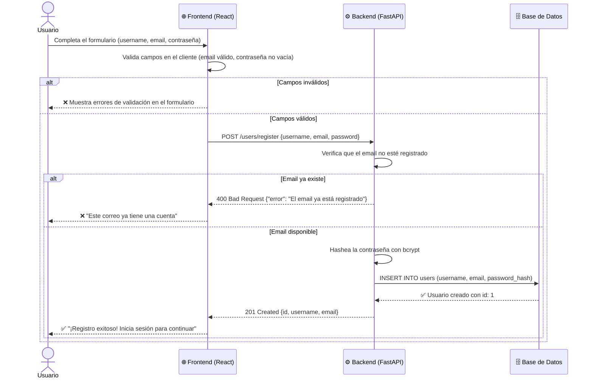
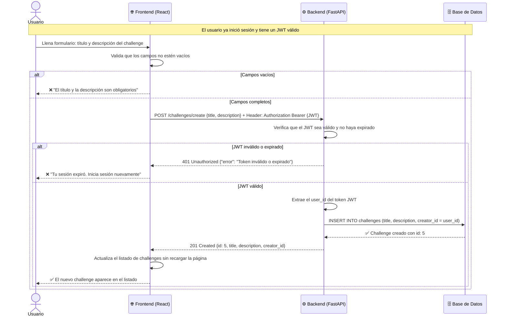

# D06 — Diagramas de Secuencia
## ComplexityLab

> **¿Qué es un diagrama de secuencia?**
> Muestra el **orden exacto** en que los diferentes componentes del sistema se comunican cuando ocurre una acción. Es como un guion de una película: quién habla primero, qué dice, quién responde.

---

## D06-A: Flujo de Registro de Usuario

> **¿Qué muestra?** Lo que pasa internamente cuando un usuario nuevo se registra en la plataforma.

---

## D06-B: Flujo de Creación de un Challenge

> **¿Qué muestra?** Lo que pasa cuando un usuario autenticado crea un nuevo challenge de programación.

---

## Resumen: ¿Por qué estos dos flujos?

| Flujo | Por qué es importante |
|-------|--------------------|
| **Registro** | Es el punto de entrada al sistema. Demuestra la validación en frontend, el hasheo de contraseña en backend y la escritura en base de datos. |
| **Creación de Challenge** | Es la operación CRUD principal del sistema. Demuestra la autenticación con JWT, la lógica de negocio en el backend y la actualización dinámica del frontend sin recargar la página. |
