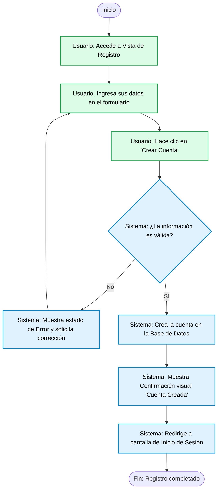
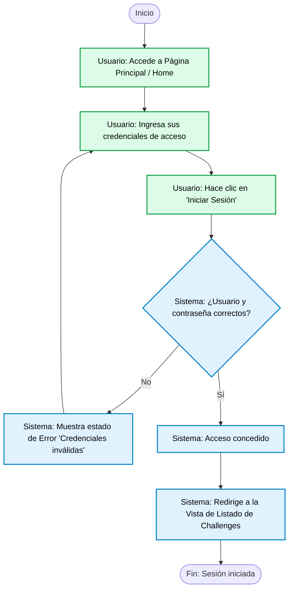
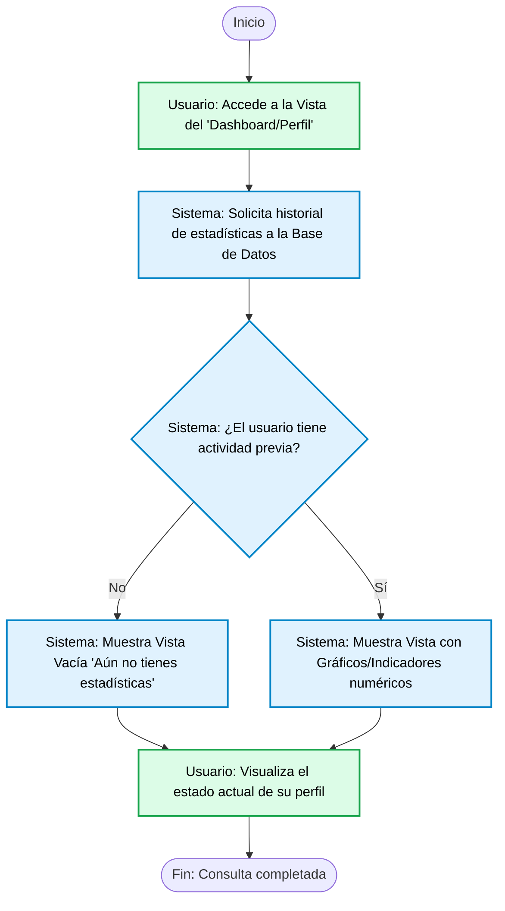
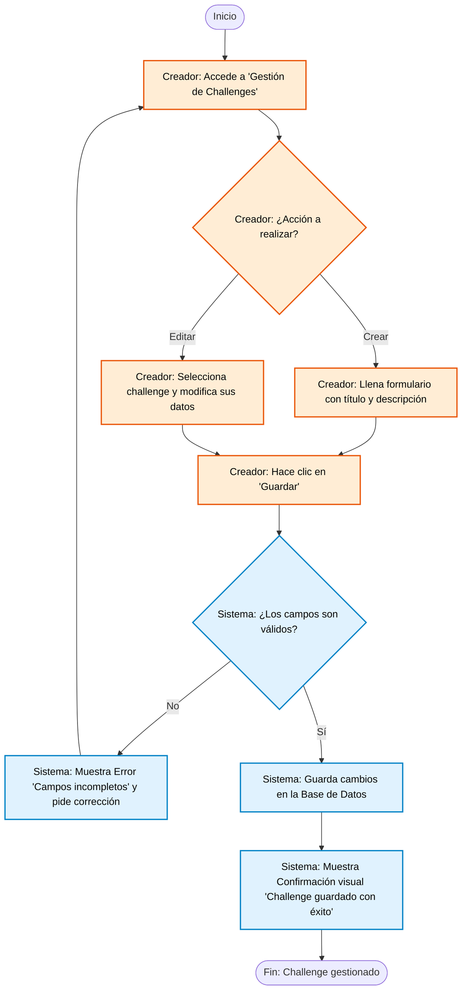
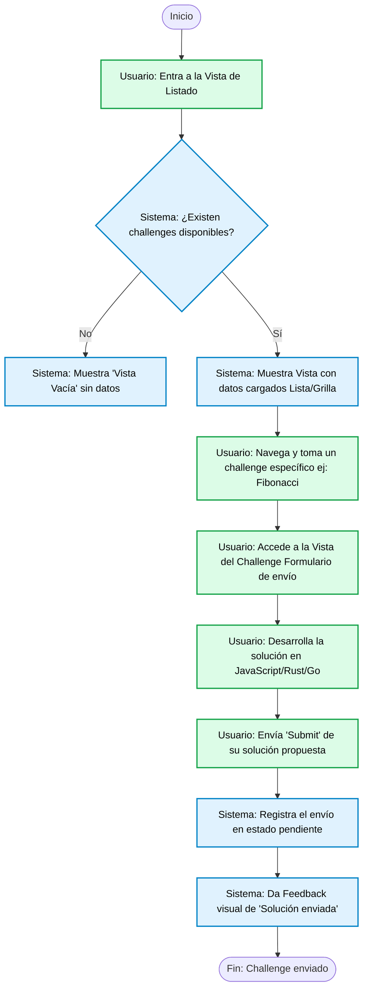
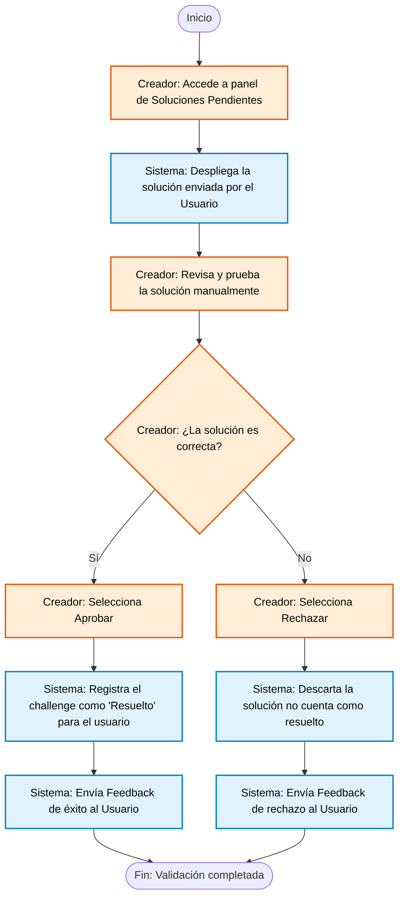
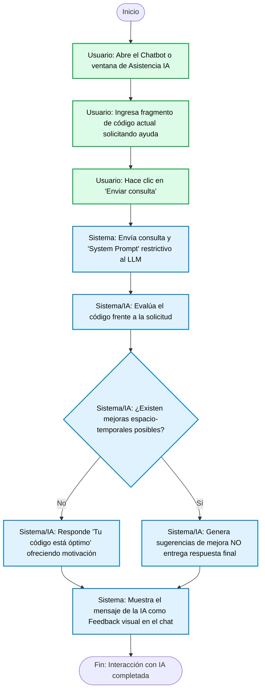

# Diagramas de Flujo - Complexity Lab

A continuación, se presentan los diagramas de flujo modelados específicamente para cumplir con los requerimientos lógicos de **Complexity Lab** y alineados con los **criterios de evaluación del prototipo navegable** (como los estados de interfaz y la retroalimentación al usuario).

## Registro de Usuario (Vista Formulario)

Este flujo aborda la creación de cuenta, mostrando escenarios de validación y **feedback al usuario** antes de conceder acceso.

## Inicio de Sesión (Página Principal / Home)

Representa la entrada a la plataforma y la validación de credenciales.

## Consulta del Dashboard (Estadísticas del Usuario)

Este flujo representa cómo un usuario consulta su progreso en la plataforma, visualizando sus challenges creados contra los resueltos. Contempla de nuevo el estado de *Vista vacía*.

## Creación y Edición de un Challenge (Gestión del Docente)

Este proceso muestra cómo un Docente o Creador añade un nuevo challenge al sistema o modifica uno existente (CRUD).

## Resolución de un Challenge (Vistas de Listado y Formulario)

Este proceso es vital ya que recorre la **Vista de Listado** y la **Vista de Formulario** (detalle del reto). Muestra cómo se contemplan los **estados vacíos** y **con datos cargados** que pide la rúbrica.

## Validación del Challenge (Vista del Creador)

Este ciclo manual no involucra IA y hace partícipe al **Creador del challenge**, encargado de evaluar la solución antes de cambiar el estado oficial del progreso del estudiante.

## Interacción con el Analizador IA (Chatbot de Optimización)

Muestra los pasos donde el usuario interactúa con la IA enviando código para obtener feedback guiado. Note cómo la IA se restringe de dar la respuesta final y provee el feedback requerido.

